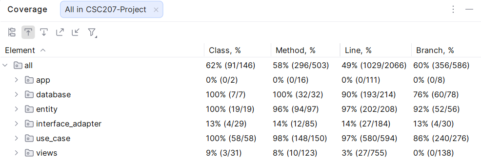

# Suitable: Personal Outfit Advisor

[](https://adoptium.net/temurin/releases/?version=17)
[](https://maven.apache.org/install.html)
[](LICENSE.txt)

Suitable is a Java desktop application that manages a user's real-life wardrobe and recommends outfits based on weather,
events, color and style preferences, or user-created tags. It was created as a CSC207 team project to make everyday
outfit planning easier while applying Clean Architecture and SOLID design principles.


## Table of Contents

- [Contributors](#contributors)
- [Features](#features)
- [Installation](#installation)
    - [Requirements](#requirements)
    - [Configure API Integrations](#configure-api-integrations)
    - [Run Application](#run-application)
- [Usage Guide](#usage-guide)
- [Troubleshooting](#troubleshooting)
- [Project Details](#project-details)
    - [Architecture and Local Data](#architecture-and-local-data)
    - [Testing](#testing)
    - [Current Scope](#current-scope)
- [Feedback](#feedback)
- [Contributing](#contributing)
- [License](#license)

## Contributors

Suitable was created and maintained by the following contributors:

- [aimangit-hub (Aiman Suhail)](https://github.com/aimangit-hub)
- [mach1044 (Max Chen)](https://github.com/mach1044)
- [Kircerta (Zixiang Zhang)](https://github.com/Kircerta)
- [wangedison92-sketch (Guanxi Wang)](https://github.com/wangedison92-sketch)
- [Fei-Sheng-Wu (Jet Wang)](https://github.com/Fei-Sheng-Wu)

The complete commit-based contribution history is available on
the [GitHub Contributors](https://github.com/Fei-Sheng-Wu/CSC207-Project/graphs/contributors) page.

## Features

- **Wardrobe management:** Add, edit, and remove inner topwear, outer topwear, bottomwear, footwear, headwear, and
  accessories.
- **Detailed item records:** Store each item's name, brand, color, style, condition, purchase date, fondness, and
  custom tags.
- **Search and organization:** Filter by name, category, condition, age, or tag, and sort by type, name, or brand.
- **Wardrobe analysis:** Review totals, average fondness, donation candidates, item ages, and category and condition
  distributions.
- **Context-based recommendations:** Generate outfits using current weather, supported events, location settings, and
  optional color and style preferences.
- **Tag-based recommendations:** Generate outfits locally from custom tags and optional color and style preferences.
- **Outfit inspiration:** Search an external inspiration service for ideas related to a selected wardrobe item.
- **Local persistence:** Keep wardrobe items and settings between sessions in the user's home directory.
- **High-contrast mode:** Switch between the normal theme and a persistent high-contrast interface.

## Installation

### Requirements

Suitable is a Java Swing application intended for Windows, macOS, and Linux systems with a graphical desktop
environment.

| Software     | Required version | Purpose                                      |
|--------------|------------------|----------------------------------------------|
| JDK          | ≥ 17             | Compile and run the application              |
| Apache Maven | ≥ 3.6.3          | Resolve dependencies, compile, run, and test |

THe project depends on the following Maven dependencies.

| Dependency                                                                                                                                             | Scope  | Version  | Purpose                                         |
|--------------------------------------------------------------------------------------------------------------------------------------------------------|--------|----------|-------------------------------------------------|
| [**JSON In Java** (org.json/json)](https://mvnrepository.com/artifact/org.json/json/20231013)                                                          |        | 20231013 | Read and write JSON data                        |
| [**OkHttp** (com.squareup.okhttp3/okhttp)](https://mvnrepository.com/artifact/com.squareup.okhttp3/okhttp/4.12.0)                                      |        | 4.12.0   | Call weather, holiday, and inspiration services |
| [**FlatLaf** (com.formdev/flatlaf)](https://mvnrepository.com/artifact/com.formdev/flatlaf/3.7.2)                                                      |        | 3.7.2    | Render the Swing interface themes               |
| [**FlatLaf IntelliJ Themes Pack** (com.formdev/flatlaf-intellij-themes)](https://mvnrepository.com/artifact/com.formdev/flatlaf-intellij-themes/3.7.2) |        | 3.7.2    | Render the Swing interface themes               |
| [**JDatePicker** (org.jdatepicker/jdatepicker)](https://mvnrepository.com/artifact/org.jdatepicker/jdatepicker/2.0.1)                                  |        | 2.0.1    | Select clothing purchase dates                  |
| [**JUnit Jupiter (Aggregator)** (org.junit.jupiter/junit-jupiter)](https://mvnrepository.com/artifact/org.junit.jupiter/junit-jupiter/5.11.4)          | `test` | 5.11.4   | Run automated tests                             |
| [**Mockito Core** (org.mockito/mockito-core)](https://mvnrepository.com/artifact/org.mockito/mockito-core/5.13.0)                                      | `test` | 5.13.0   | Create test doubles                             |

Confirm that the required tools are available:

```bash
java -version
mvn -version
```

The Java output must report version 17 or newer, and Maven must report version 3.6.3 or newer.

### Configure API Integrations

The wardrobe, tag-based recommendation, statistics, settings, and high-contrast features operate locally. Context-based
recommendations and outfit inspiration use the environment variables listed below.

| Environment Variable   | Value                             | Used by                       |
|------------------------|-----------------------------------|-------------------------------|
| `API_BASE_URL_WEATHER` | `https://api.weatherapi.com/v1`   | Context-based recommendations |
| `API_KEY_WEATHER`      | A WeatherAPI API key              | Context-based recommendations |
| `API_BASE_URL_HOLIDAY` | `https://calendarific.com/api/v2` | Context-based recommendations |
| `API_KEY_HOLIDAY`      | A Calendarific API key            | Context-based recommendations |
| `API_BASE_URL_SOCIAL`  | `https://www.socialcrawl.dev/v1`  | Outfit inspiration            |
| `API_KEY_SOCIAL`       | A SocialCrawl API key             | Outfit inspiration            |

Keep API keys outside version control and export them in the terminal that launches Suitable.

On macOS or Linux:

```bash
export API_BASE_URL_WEATHER="https://api.weatherapi.com/v1"
export API_KEY_WEATHER="weatherapi-api-key"
export API_BASE_URL_HOLIDAY="https://calendarific.com/api/v2"
export API_KEY_HOLIDAY="calendarific-api-key"
export API_BASE_URL_SOCIAL="https://www.socialcrawl.dev/v1"
export API_KEY_SOCIAL="socialcrawl-api-key"
```

On Windows PowerShell:

```powershell
$env:API_BASE_URL_WEATHER = "https://api.weatherapi.com/v1"
$env:API_KEY_WEATHER = "weatherapi-api-key"
$env:API_BASE_URL_HOLIDAY = "https://calendarific.com/api/v2"
$env:API_KEY_HOLIDAY = "calendarific-api-key"
$env:API_BASE_URL_SOCIAL = "https://www.socialcrawl.dev/v1"
$env:API_KEY_SOCIAL = "socialcrawl-api-key"
```

### Run Application

To run Suitable from the JAR artifact, download the `suitable-*.jar` file from `/build` or
from [GitHub Releases](https://github.com/Fei-Sheng-Wu/CSC207-Project/releases). Then, simply run the JAR artifact as:

```bash
java -jar path/to/file.jar
```


To run Suitable from the source, clone the repository. From the repository root, compile and start Suitable:

```bash
git clone https://github.com/Fei-Sheng-Wu/CSC207-Project.git
cd CSC207-Project
mvn clean compile exec:java
```

The first build can take longer while Maven downloads dependencies. Alternatively, to run from an IDE instead, import
`pom.xml` as a Maven project, select JDK 17 or newer, and run the `main` method in
`src/main/java/app/Main.java`.

## Usage Guide

### 1. Configure Location and Contrast

Open **Settings**, enter a city and a two-letter ISO country code such as `CA`, optionally enable high-contrast mode,
and select **Save Settings**. Context-based recommendations use this location.


### 2. Add and Edit Clothing

Open **My Wardrobe** and select **Add Item**. Choose the clothing type, complete the fields that describe the item, and
select **Update Item** to save it. Use comma-separated tags such as `rain, hiking` when the item should participate in
tag-based recommendations.


Use **Edit Item** to revise an existing record or **Remove Item** to delete it. Suitable writes changes to local JSON
immediately.

### 3. Filter, Sort, and Analyze the Wardrobe

The wardrobe toolbar provides three organization tools:

1. **Filter** narrows items by name, category, condition, months since purchase, or tag.
2. **Sort By** orders items by type, name, or brand.
3. **Report Statistics** shows wardrobe totals, fondness, age, donation candidates, and category and condition
   distributions.


### 4. Generate an Outfit Recommendation

Open **Recommendation**, optionally select a preferred color and style, and choose one of the following modes:

- **Use Current Weather & Events** uses the saved city and country together with the configured weather and holiday
  services.
- **Use My Custom Tags** ranks wardrobe items locally using the entered tags.

Select **Get Recommendation** to see the chosen clothing slots and an explanation. A complete recommendation requires at
least one inner topwear, one bottomwear, and one footwear item in the wardrobe.


### 5. Find Outfit Inspiration

Edit an item and select **Get Inspired**. Suitable searches the configured SocialCrawl service using the item's color,
name, and brand. Select **Open** on a result to view its source in the system browser.

## Troubleshooting

| Problem                                                               | Resolution                                                                                                                                                |
|-----------------------------------------------------------------------|-----------------------------------------------------------------------------------------------------------------------------------------------------------|
| `java Main.java` reports `ClassNotFoundException`                     | Run `mvn clean compile exec:java` from the repository root; the packaged entry point is `app.Main`.                                                       |
| `java` or `mvn` is not found                                          | Install the required software above, open a new terminal, and repeat `java -version` and `mvn -version`.                                                  |
| Maven reports an unsupported Java release                             | Ensure Maven is using JDK 17 or newer; `mvn -version` displays the active Java runtime.                                                                   |
| Weather or event recommendations report that a service is unavailable | Configure the required environment variables in the same terminal before starting Suitable, then verify the city and two-letter country code in Settings. |
| Inspiration curation fails                                            | Configure the environment variables related to SocialCrawl services.                                                                                      |
| The first build appears slow                                          | Allow Maven to finish downloading dependencies. Later builds reuse the local Maven cache.                                                                 |
| Local wardrobe or settings data is invalid                            | Close Suitable, back up `~/suitable`, and move the directory aside. Suitable creates fresh files on the next launch.                                      |

If the problem remains, gather the operating system, JDK and Maven versions, error text, and reproduction steps before
opening an issue via [GitHub Issues](https://github.com/Fei-Sheng-Wu/CSC207-Project/issues).

## Project Details

### Architecture and Local Data

Suitable follows Clean Architecture. Dependencies point inward toward application-independent entities and use cases.

| Package             | Responsibility                                                                          |
|---------------------|-----------------------------------------------------------------------------------------|
| `entity`            | Wardrobe, clothing, outfit, weather, event, and settings domain models                  |
| `use_case`          | Application rules for wardrobe operations, recommendations, inspiration, and settings   |
| `interface_adapter` | Controllers, presenters, state, and view models that translate between UI and use cases |
| `database`          | Local JSON/properties persistence and external HTTP service adapters                    |
| `views`             | Java Swing screens and reusable UI components                                           |
| `app`               | Dependency registration, application composition, and startup                           |

Suitable creates these files automatically:

- `~/suitable/wardrobe.json` stores wardrobe records.
- `~/suitable/user.properties` stores the city, country code, and high-contrast preference.

API keys are read from environment variables. Weather requests send the configured city, holiday requests send the
configured country code, and inspiration requests use the selected item's color, name, and brand.

### Testing

Run the automated suite from the repository root:

```bash
mvn test
```

The suite covers entities, wardrobe use cases, recommendation logic, presenters, controllers, persistence, and
background requests. Live WeatherAPI and SocialCrawl integration tests activate when their corresponding environment
variables are present; JUnit skips them when credentials are absent.



### Current Scope

- Suitable is currently provided as source under `/src` and as a JAR artifact under `/build`.
- API calls require third-party services and valid credentials.
- Cotext-based recommendations use the bundled holiday-to-event mapping.

## Feedback

Submit feedback through [GitHub Discussions](https://github.com/Fei-Sheng-Wu/CSC207-Project/discussions). Search
existing discussions first, then open a new discussion when the topic has not already been reported.

Valid feedback includes reproducible defects, accessibility problems, documentation corrections, and focused feature
proposals. If the feedback is related to bugs and unexpected behaviors, consider
using [GitHub Issues](https://github.com/Fei-Sheng-Wu/CSC207-Project/issues) instead and reference
the [issue template](ISSUE_TEMPLATE.md).

Maintainers prioritize unique, respectful, on-topic, reproducible reports with secrets redacted. They triage submissions
when available, may request more information, and may accept, defer, or decline a proposal.

## Contributing

Protect `main` by submitting every contribution through a reviewed pull request.

1. [Fork the repository](https://docs.github.com/en/pull-requests/how-tos/work-with-forks/fork-a-repo) on GitHub.
2. Clone your fork and configure the project repository as `upstream`:

   ```bash
   git clone https://github.com/YOUR-USERNAME/CSC207-Project.git
   cd CSC207-Project
   git remote add upstream https://github.com/Fei-Sheng-Wu/CSC207-Project.git
   ```

3. Synchronize and branch from the latest `main`:

   ```bash
   git fetch upstream
   git switch main
   git merge --ff-only upstream/main
   git switch -c feat/short-description
   ```

4. Make a focused change that preserves the project's Clean Architecture boundaries and existing style.
5. Run `mvn test` and resolve relevant failures.
6. Commit the change, push the branch to your fork,
   and [open a pull request](https://docs.github.com/en/pull-requests/how-tos/create-pull-requests/creating-a-pull-request-from-a-fork)
   targeting `Fei-Sheng-Wu/CSC207-Project:main`.
7. Complete every section of the [pull request template](PULL_REQUEST_TEMPLATE.md), link related issues, explain
   testing, and keep the branch current with `main`.

Use the branch pattern `<category>/<short-description>`, where the category is normally `feat`, `fix`, `test`,
`refactor`, or `chore`.

A pull request must receive at least one approving review before merge. Reviewers check scope, correctness,
architecture, tests, and documentation; they may request changes. A maintainer merges the branch after required feedback
is addressed and the branch is ready.

## License

Suitable is available under the [MIT License](LICENSE.txt).
